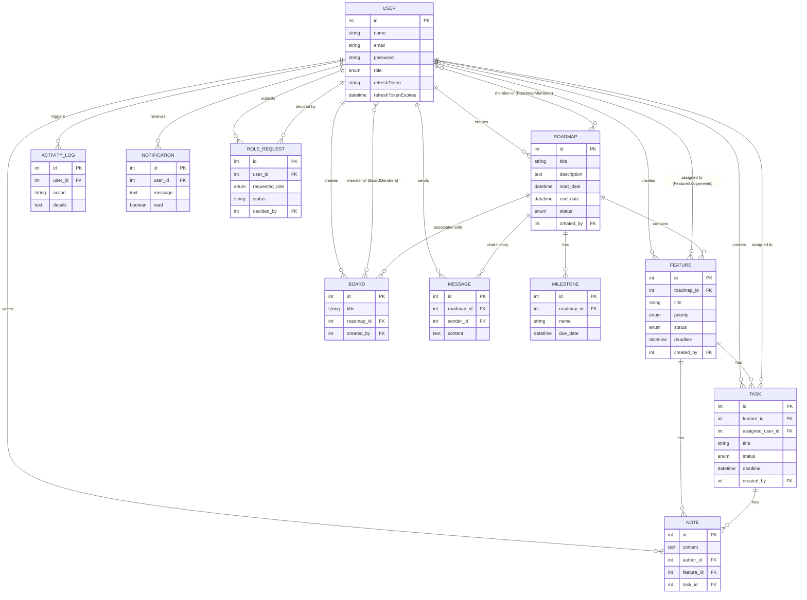

# Backend Entity Relationship Diagram

This diagram illustrates the database schema and relationships for the Product Roadmap System.

```mermaid
erDiagram
    USER ||--o{ ROADMAP : "creates"
    USER ||--o{ FEATURE : "creates"
    USER ||--o{ TASK : "creates"
    USER ||--o{ BOARD : "creates"
    USER ||--o{ ACTIVITY_LOG : "triggers"
    USER ||--o{ MESSAGE : "sends"
    USER ||--o{ NOTIFICATION : "receives"
    USER ||--o{ ROLE_REQUEST : "submits"
    USER ||--o{ NOTE : "writes"

    USER }o--o{ BOARD : "member of (BoardMembers)"
    USER }o--o{ FEATURE : "assigned to (FeatureAssignments)"
    USER }o--o{ ROADMAP : "member of (RoadmapMembers)"

    ROADMAP ||--o{ FEATURE : "contains"
    ROADMAP ||--o{ MILESTONE : "has"
    ROADMAP ||--o{ BOARD : "associated with"
    ROADMAP ||--o{ MESSAGE : "chat history"

    FEATURE ||--o{ TASK : "has"
    FEATURE ||--o{ NOTE : "has"

    TASK ||--o{ NOTE : "has"
    TASK }o--|| USER : "assigned to"

    ROLE_REQUEST }o--|| USER : "decided by"

    USER {
        int id PK
        string name
        string email
        string password
        enum role
        string refreshToken
        datetime refreshTokenExpires
    }

    ROADMAP {
        int id PK
        string title
        text description
        datetime start_date
        datetime end_date
        enum status
        int created_by FK
    }

    FEATURE {
        int id PK
        int roadmap_id FK
        string title
        enum priority
        enum status
        datetime deadline
        int created_by FK
    }

    MILESTONE {
        int id PK
        int roadmap_id FK
        string name
        datetime due_date
    }

    TASK {
        int id PK
        int feature_id FK
        int assigned_user_id FK
        string title
        enum status
        datetime deadline
        int created_by FK
    }

    BOARD {
        int id PK
        string title
        int roadmap_id FK
        int created_by FK
    }

    NOTE {
        int id PK
        text content
        int author_id FK
        int feature_id FK
        int task_id FK
    }

    MESSAGE {
        int id PK
        int roadmap_id FK
        int sender_id FK
        text content
    }

    ROLE_REQUEST {
        int id PK
        int user_id FK
        enum requested_role
        string status
        int decided_by FK
    }

    NOTIFICATION {
        int id PK
        int user_id FK
        text message
        boolean read
    }

    ACTIVITY_LOG {
        int id PK
        int user_id FK
        string action
        text details
    }
```
